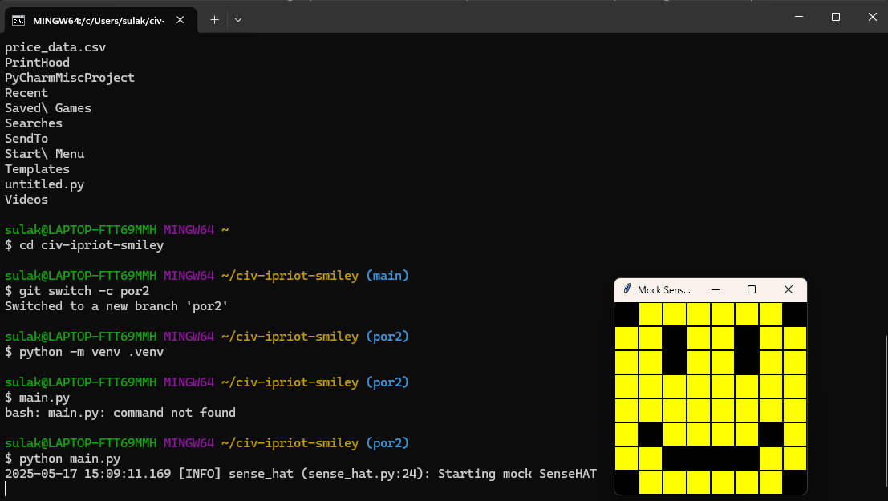

<style>

body {
    counter-reset: h2counter;
}

/* H1 - No numbering */
h1 {
    /* No counter reset or increment */
}

/* H2 - Level 1 numbering */
h2 {
    counter-reset: h3counter;
}

h2::before {
    counter-increment: h2counter;
    content: counter(h2counter) ". ";
}

/* H3 - Level 2 numbering */
h3 {
    counter-reset: h4counter;
}

h3::before {
    counter-increment: h3counter;
    content: counter(h2counter) "." counter(h3counter) " ";
}

/* H4 - Level 3 numbering (optional) */
h4 {
    counter-reset: h5counter;
}

h4::before {
    counter-increment: h4counter;
    content: counter(h2counter) "." counter(h3counter) "." counter(h4counter) " ";
}

</style>

# Evidence and Knowledge

This document includes instructions and knowledge questions that must be completed to receive a *Competent* grade on this portfolio task.

## Required evidence

### Answer all questions in this document

- Each answer should be complete, well-articulated, and within the specified word count limits (if added) for each question.
- Please make sure **all** external sources are properly cited.
- You must **use your own words**. Please include your full chat transcripts if you use generative AI in any way.
- Generative AI hallucinates, is not an authoritative source

### Make all the required modifications to the code

- Please follow the instructions in this document to make the changes needed to the code.

- When requested to upload evidence, upload all screenshots to `screenshots/` and embed them in this document. For example:

```markdown

```

- You must upload the code into your GitHub repository.
- While you can use a branch, your code should be in main when you submit.
- Upload a zip of this repository to Blackboard when you are ready to submit.
- You will be notified of your result via Blackboard
- However, if using GitHub classrooms, you may also receive additional feedback on GitHub directly

### Optional: Use of Raspberry Pi and SenseHat

Raspberry Pi or SenseHat is **optional** for this activity. You can use the included `sense_hat.py` file to simulate the SenseHat on your computer.

If you use a Pi, please **delete** the `sense_hat.py` file.

### Accessible version of the code

This project relies on visual patterns that appear on an LED matrix. If you have any accessibility requirements, you can use the `udl/accessible` branch to complete the project. This branch provides an accessible code version that uses text-based patterns instead of visual ones.

Please discuss this with your lecturer before using that branch.

## Specific Tasks & Questions

Address the following tasks and questions based on the code provided in this repository.

### Set up the project locally

1. Fork this repository (if not using GitHub Classrooms)
2. Clone your repository locally
3. Run the project locally by executing the `main.py` file
4. Evidence this by providing screenshots of the project directory structure and the output of the `main.py` file



If you are running on a Raspberry Pi, you can use the following command to run the project and then screenshot the result:

```bash
ls
python3 main.py
```

### Fundamental code comprehension

 Answer each of the following questions **as they relate to that code** supplied by in this repository (ignore `sense_hat.py`):

1. Examine the code for the `smiley.py` file and provide  an example of a variable of each of the following types and their corresponding values (`_` should be replaced with the appropriate values):

   | Type                    | name       | value          |
   | ----------              | ---------- | -------------- |
   | built-in primitive type | dimmed     |  True or False |
   | built-in composite type | white      |  (255,255,255) |
   | user-defined type       | Smiley     |  class Smiley  |

2. Fill in (`_`) the following table based on the code in `smiley.py`:

   | Object                   | Type                    |
   | ------------             | ----------------------- |
   | self.pixels              | built-in-composite type |
   | A member of self.pixels  | build-in-composite type |
   | self                     | user-defined type       |

3. Examine the code for `smiley.py`, `sad.py`, and `happy.py`. Give an example of each of the following control structures using an example from **each** of these files. Include the first line and the line range:

   | Control Flow | File       | First line     | Line range                             |
   | ------------ | ---------- | -----------    | ------------------------------------   |
   |  sequence    | smiley.py  | line 1         | Line 1, 4-9, 11-26, 28-33, 35-39       |
                  | sad.py     | line 1         | Line 1, 4-8, 14, 16, 23, 29            |
                  | happy.py   | line 1         | Line 1-3, 6, 10-14, 20, 22, 29, 39-43  |
   |  selection   | smiley.py  | line 28        | Line 28 to 33                          |
                  | sad.py     | line 26        | Line 26 to 29                          |
                  | happy.py   | line 31        | Line 31                                |
   |  iteration   | smiley.py  | No direct loop | No direct loop                         |
                  | sad.py     | line 16        | Lines 16-17 and 25-30                  |
                  | happy.py   | line 21        | Lines 21-22 and 30-31                  |

4. Though everything in Python is an object, it is sometimes said to have four "primitive" types. Examining the three files `smiley.py`, `sad.py`, and `happy.py`, identify which of the following types are used in any of these files, and give an example of each (use an example from the code, if applicable, otherwise provide an example of your own):

   | Type                    | Used? | Example                                                  |
   | ----------------------- | ----- | ---------------------------------------------------------|
   | int                     | Yes   | YELLOW =(255, 255, 0) in smiley.py                       |
   | float                   | Yes   | delay = 0.25 in blink() in happy.py                      |
   | str                     | Yes   | """Draws the eyes...""" in docstrings (happy.py)         |
   | bool                    | Yes   | dimmed = True in smiley.py and wide_open = True in sad.py|

5. Examining `smiley.py`, provide an example of a class variable and an instance variable (attribute). Explain **why** one is defined as a class variable and the other as an instance variable.

> In the smiley.py, an example of class variable is YELLOW = (255, 255, 0) as it never changes per instance, that is, every smiley object uses the same RGB value for yellow. It helps reduce redundancy and memory usage.

>Similarly, self.pixels is an instance variable as it is unique to each object (happy or sad) and its value must be stored per instance.

6. Examine `happy.py`, and identify the constructor (initializer) for the `Happy` class:
   The constructor (initialiser) for the Happy class is:
   def __init__(self):
        super().__init__()
        self.draw_mouth()
        self.draw_eyes()

   1. What is the purpose of a constructor (in general) and this one (in particular)?

   > A constructor is a special method within a class that gets automatically called when we create a new object(instance) of that class. 
   >In the Happy class, the constructor initialises the Happy object by calling the parent class's constructor using super().__init__(). It then customises the object to have a happy expression by calling self.draw_mouth() and self.draw_eyes().

   2. What statement(s) does it execute (consider the `super` call), and what is the result?

   > The constructor executes three statements.
    First, it executes super().__init__(). This calls the parent classes Smiley and Blinkable via multiple inheritance. It sets up inherited attributes like self.pixels from Smiley.
   >self.draw_mouth() is executed is next. This updates specific pixels to change the mouth into a 'happy' shape and blanks certain pixels.
   >Finally, self.draw_eyes() is executed. This draws (wide open by default) by modifying specific pixels in self.pixels.

### Code style

1. What code style is used in the code? Is it likely to be the same as the code style used in the SenseHat? Give to reasons as to why/why not:
   
>The code style used in the code is the Python's standard style guide, PEP8. 
>The code style used in the SenseHat could likely be the same as the one in other files as the Python libraries that are part of the standard Raspberry Pi ecosystem (like SenseHat) usually follow PEP 8 for consistency and readability. While many libraries follow PEP8, not all hardware specific libraries do. So there is a possibility that SenseHat's internal code may include C-style conventions especially if some parts were generated automatically or wrapped from C or C++.

2. List three aspects of this convention you see applied in the code.

> Three aspects of the PEP8 convention observed in the code are:
>Class names are written beginning with an upper case or CamelCase. For example, class Smiley, class Happy
>Function names are written using lowercase with underscores in between. For example, draw_eyes, draw_mouth
>There is consistent indentation with 4 spaces.

3. Give two examples of organizational documentation in the code.

> Docstrings: """Provides a Smiley with a happy expression""" 
>commenting a line of code: # We have encapsulated the SenseHat object

### Identifying and understanding classes

> Note: Ignore the `sense_hat.py` file when answering the questions below

1. List all the classes you identified in the project. Indicate which classes are base classes and which are subclasses. For subclasses, identify all direct base classes.
  
  Use the following table for your answers:

| Class Name | Super or Sub? | Direct parent(s) |
| ---------- | ------------- | ---------------- |
| NotReal    | Sub           | NotRealParent    |
| Smiley     |  Super        | Object           |
| Blinkable  |  Super        | Object           |
| Sad        |  Sub          | Smiley           |
| Happy      |  Sub          | Smiley, Blinkable|

2. Explain the concept of abstraction, giving an example from the project (note "implementing an ABC" is **not** in itself an example of abstraction). (Max 150 words)

> Abstraction is the concept of hiding complex implementation details and exposing only the essential features of an object or process. It helps reduce complexity and makes the code easier to use and maintain. In this project, the Smiley class is an example of abstraction. It encapsulates the low-level details of interacting with the Sense HAT hardware, such as setting individual pixel colors and controlling brightness. Users of the Smiley class don’t need to know how pixel data is stored or how SenseHat.set_pixels() works—they just call high-level methods like show() or manipulate expressions through subclasses like Happy or Sad. This allows developers to work with smiley faces visually, without dealing directly with hardware or pixel matrix logic. This abstraction makes the code more readable, modular, and reusable, especially in educational or creative contexts.

3. What is the name of the process of deriving from base classes? What is its purpose in this project? (Max 150 words)

>The process of deriving from base classes is called inheritance. In this project, inheritance is used to promote code reuse and specialization. The Smiley class acts as a base class that defines shared behavior and attributes—such as color constants, pixel layout, and display control using the Sense HAT. Subclasses like Happy and Sad inherit these features and extend or modify them to represent specific facial expressions. For example, Happy and Sad both reuse the pixel setup and show() method from Smiley, but each class adds its own logic for drawing eyes and mouths. Happy also inherits from Blinkable, allowing it to add blinking behavior without duplicating code. By using inheritance, the project avoids redundancy and keeps the code organized, enabling easier maintenance and extension.
>

### Compare and contrast classes

Compare and contrast the classes Happy and Sad.

1. What is the key difference between the two classes?
   > The key difference between the two classes is that the Happy class inherits from both Smiley and Blinkable, so it can draw a smiling mouth and wide or blinking eyes. On the other hand, the Sad class only inherits from Smiley. This means that the Happy smiley can blink its eyes, while the Sad smiley cannot.
   >
2. What are the key similarities?
   > Both Happy and Sad classes share the same base class, Smiley and therefore have access to the same basic methods and properties for drawing the smiley face.
   >
3. What difference stands out the most to you and why?
   > The most significant difference between Happy and Sad is that Happy class has the ability show blinking eyes due to its inheritance from Blinkable, while the Sad class cannot. This distinction is crucial because it adds an extra layer of expressiveness to the Happy smiley, allowing it to convey more emotions.
   >
4. How does this difference affect the functionality of these classes
   > The difference in blinking capability affects the functionality of these classes by allowing the Happy smiley to exhibit a more dynamic and engaging behavior, while the Sad smiley, lacking this feature, may come across as more static and less expressive, potentially limiting its emotional range.

### Where is the Sense(Hat) in the code?

1. Which class(es) utilize the functionality of the SenseHat?
   > The classes that utilise the functionality of the SenseHat are Smiley, Happy, and Sad.
   >
2. Which of these classes directly interact with the SenseHat functionalities?
   > Smiley directly interacts with the SenseHat functionalities by controlling the LED matrix and handling pixel data.
   >
3. Discuss the hiding of the SenseHAT in terms of encapsulation (100-200 Words)
   Encapsulation refers to the practice of grouping related data and the methods that operate on that data within a class, while hiding the internal implementation details from outside access. In this project, the Smiley class encapsulates all interactions with the SenseHat hardware. The specifics of setting pixel colors and controlling the LED matrix are kept private within the class, so users do not need to understand or access these low-level operations. Instead, they use simple, high-level methods like Happy or Sad to change expressions. This approach streamlines the user experience, making it easier to create and display smiley faces without dealing with the complexities of hardware control.

### Sad Smileys Can’t Blink (Or Can They?)

Unlike the `Happy` smiley, the current implementation of the `Sad` smiley does not possess the ability to blink. Let's first explore how blinking has been implemented in the Happy Smiley by examining the blink() method, which takes one argument that determines the duration of the blink.

**Understanding Blink Mechanism:**

1. Does the code's author believe that every `Smiley` should be able to blink? Explain.

> Author does not believe that every Smiley should be able to blink. The `Blinkable` class is designed to be inherited by specific smiley classes, like `Happy`, indicating that not all smileys are intended to have blinking functionality. This design choice allows for flexibility in defining which smileys can exhibit this behavior, while others, like `Sad`, do not require it. By using inheritance, the author aims to create specialised classes with unique features without forcing all smileys to have the same capabilities.
>

2. For those smileys that blink, does the author expect them to blink in the same way? Explain.

> The author does not explicitly state that all blinking smileys must blink in the same way. However, by using a common base class, `Blinkable`, it is implied that there will be a shared interface or behavior for blinking. Subclasses can then override or extend this behavior as needed, allowing for variations in how each smiley blinks while still adhering to a common structure.

3. Referring to the implementation of blink in the Happy and Sad Smiley classes, give a brief explanation of what polymorphism is.

> Polymorphism is the ability of different classes to be treated as instances of the same class through a common interface. In this context, both Happy and Sad smileys can be treated as `Blinkable` objects, allowing them to be used interchangeably in code that expects a `Blinkable` type, even though their specific implementations of the blink behavior may differ.

4. How is inheritance used in the blink method, and why is it important for polymorphism?

> In the blink method, inheritance is used to allow the `Happy` class to inherit from the `Blinkable` class, which defines the blinking behavior. This is important for polymorphism because it enables different smiley classes (like `Happy` and `Sad`) to implement their own versions of the blink method while still being treated as instances of the same base class. This allows for flexibility in how each smiley blinks while maintaining a consistent interface.
>
1. **Implement Blink in Sad Class:**

   - Create a new method called `blink` within the Sad class. Ensure you use the same method signature as in the Happy class:

   ```python
   def blink(self, delay=0.25):

       pass  # Replace 'pass' with your implementation
   ```

2. **Code Implementation:** Implement the code that allows the Sad smiley to blink. Use the implementation from the Happy Smiley as a reference. Ensure your new method functions similarly by controlling the blink duration through the `delay` argument.

3. **Testing the Implementation:**

- Test the new blink functionality on your Raspberry Pi or within the Python classes provided. You might need to adjust the `main.py` script to incorporate Sad Smiley's new blinking capability.

Include a screenshot of the sad smiley or the modified `main.py`:-


- Observe and document the Sad smiley as it blinks its eyes. Describe any adjustments or issues encountered during implementation.

  > > After implementing the `blink` method in the Sad smiley, I observed that the Sad smiley successfully blinks its eyes on the display, similar to the Happy smiley. The eyes briefly change color (from blank to yellow and back) according to the specified delay, giving the appearance of blinking. The main adjustment required was ensuring that the `draw_eyes` method correctly handled the `wide_open` parameter to switch between open and closed states. No major issues were encountered, but I had to verify that the `show()` method was called after each change to update the display. Overall, the implementation was straightforward, and the Sad smiley blinked as expected.

  ### If It Walks Like a Duck…

  Previously, you implemented the blink functionality for the Sad smiley without utilizing the class `Blinkable`. Assuming you did not use `Blinkable` (even if you actually did), consider how the Sad smiley could blink similarly to the Happy smiley without this specific class.

  1. **Class Type Analysis:** What kind of class is `Blinkable`? Inspect its superclass for clues about its classification.

     >Blinkable is a class that inherits from the `object` class, making it a user-defined type. It is designed to be a base class for other classes that require blinking functionality, but it does not provide any concrete implementation itself. This suggests that `Blinkable` is an abstract class or interface meant to define a common behavior (blinking) for its subclasses. 

  2. **Class Implementation:** `Blinkable` is a class intended to be implemented by other classes. What generic term describes this kind of class, which is designed for implementation by others? **Clue**: Notice the lack of any concrete implementation and the naming convention.

  > Abstract class

  3. **OO Principle Identification:** Regarding your answer to question (2), which Object-Oriented (OO) principle does this represent? Choose from the following and justify your answer in 1-2 sentences: Abstraction, Polymorphism, Inheritance, Encapsulation.

  > The object-oriented principle represented here is **Abstraction**. This is because the `Blinkable` class serves as a blueprint for other classes, defining a common interface for blinking behavior without providing specific implementation details. This allows subclasses to implement their own versions of the blink functionality maintaining a consistent structure.

  4. **Implementation Flexibility:** Explain why you could grant the Sad Smiley a blinking feature similar to the Happy Smiley's implementation, even without directly using `Blinkable`.

  > The Sad Smiley could implement a similar blinking feature by defining its own `blink` method with the same signature and behavior as the Happy Smiley's `blink` method. This was possible because both classes share a common interface and can be treated as interchangeable in contexts that require blinking functionality.

  5. **Concept and Language Specificity:** In relation to your response to question (4), what is this capability known as, and why is it feasible in Python and many other dynamically typed languages but not in most statically typed programming languages like C#? **Clue** This concept is hinted at in the title of this section.

  > This capability is known as **Duck Typing**. In Python and other dynamically typed languages, the type of an object is determined at runtime based on its behavior (methods and properties) rather than its explicit type. This allows for greater flexibility in how objects can be used interchangeably, as long as they implement the expected methods. In contrast, statically typed languages like C# require explicit type definitions, making it more challenging to treat different classes as interchangeable unless they share a common base class or interface.

  ***

  ## Refactoring

  ### Does a Smiley Have to Be Yellow?

  While our current implementation predominantly features yellow smileys, emotional expressions like sickness or anger typically utilize colors like green, red, or orange. We'll explore the feasibility of integrating these colors into our smileys.

  1. **Defined Colors and Their Location:**

     1. Which colors are defined and in which class(s)?
        > All colours (white, yellow, black, red, green) are defined in the Smiley class. But to create a smiley face only Yellow color and Black denoted by blank are used in the Smiley class.
     2. What type of variables hold these colors? Are the values expected to change during the program's execution? Explain your answer.
        > The colors are held in **class variables** (such as `YELLOW`, `BLANK`, `RED`, etc.) within the `Smiley` class. Class variables are shared across all instances of the class and are typically used for values that should remain constant for all objects, like standard colors. These values are not expected to change during the program's execution because they represent fixed color definitions. However, if a color is assigned to an **instance variable** (such as `angry`), its value can be set differently for each object when it is created, allowing different smileys to have different colors. In summary, class variables provide the standard color options, while instance variables allow for per-object customization.
     3. Add the color blue to the appropriate class using the appropriate format and values.
         > The color blue is added to the `Smiley` class as follows:
         ```python
         BLUE = (0, 0, 255)  # RGB value for blue
         ```

  2. **Usage of Color Variables:**

     1. In which classes are the color variables used?
        > Colors are used in the `Smiley`, `Sad`, and `Happy` classes.

  3. **Simple Method to Change Colors:**
  4. What is the easiest way you can think to change the smileys to green? Easiest, not necessarily the best!
     > To change the smileys to green, the easiest method would be to directly replace all instances of the `YELLOW` variable with a new color variable, such as `GREEN`, in the `Smiley` class, using find and replace command option in the IDE.

  Here's a revised version of the "Flexible Colors – Step 1" section for the smiley project, incorporating your specifications for formatting and content updates:

  ### Flexible Colors – Step 1

  Changing the color of the smileys once is straightforward, but it isn't very flexible. To facilitate various colors for smileys, it is advisable not to hardcode values in any class. This approach was identified earlier as a necessary change. Let's start by removing the built-in assumptions about color in our classes.

  1. **Add a method called `complexion` to the `Smiley` class:** Implement this instance method to return `self.YELLOW`. Using the term "complexion" instead of "color" provides a more abstract terminology that focuses on the meaning rather than implementation.
```python
  def complexion(self):
      return self.YELLOW

  2. **Refactor subclasses to use the `complexion` method:** Modify any subclass that directly accesses the color variable to instead utilize the new `complexion` method. This ensures that color handling is centralized and can be easily modified in the future.
   For example, in the `Sad` class, we can replace any direct reference to `YELLOW` with `self.complexion()`.

   ```python
   def draw_eyes(self, wide_open=True):
       """
       Draws open or closed eyes on a smiley
       :param wide_open: Render eyes wide open or shut
       """
       eyes = [10, 13, 18, 21]
       for pixel in eyes:
           if wide_open:
               eyes = self.BLANK
           else:
               eyes = self.complexion()
           self.pixels[pixel] = eyes
   ```

  3. **Determine the applicable Object-Oriented principle:** Consider whether Abstraction, Polymorphism, Inheritance, or Encapsulation best applies to the modifications made in this step.
   > The principle of **Abstraction** applies here. By introducing the `complexion` method, we abstract away the specific color implementation details from the subclasses. This allows subclasses to interact with the color in a more generic way, focusing on the concept of "complexion" rather than the specific RGB values. This abstraction makes it easier to change the underlying color logic without affecting the subclasses directly.

  4. **Verify the implementation:** Ensure that the modifications function as expected. The smileys should still display in yellow, confirming that the new method correctly replaces the direct color references.

  This step is crucial for setting up a more flexible system for color management in the smiley display logic, allowing for easy adjustments and extensions in the future.

  ### Flexible Colors – Step 2

  Having removed the hardcoded color values, we now enhance the base class to support dynamic color assignments more effectively.

  1. **Modify the `__init__()` method in the `Smiley` class:** Introduce a default argument named `complexion` and assign `YELLOW` as its default value. This allows the instantiation of smileys with customizable colors.
```python
  def __init__(self, complexion=YELLOW):
     
  2. **Introduce a new instance variable:** Create a variable called `my_complexion` and assign the `complexion` parameter to it. This step ensures that each smiley instance can maintain its own color state.
```python
      self.my_complexion = complexion
   ```
  3. **Rationale for `my_complexion`:** Using a distinct instance variable like `my_complexion` avoids potential conflicts with the method parameter names and clarifies that it is an attribute specific to the object.

  4. **Bulk rename:** We want to update our grid to use the value of complexion, but we have so many `Y`'s in the grid. Use your IDE's refactoring tool to rename all instances of the **symbol** `Y` to `X`. Where `X` is the value of the `complexion` variable. Include a screenshot evidencing you have found the correct refactor tool and the changes made.

  

  5. **Update the `complexion` method:** Adjust this method to return `self.my_complexion`, ensuring that whatever color is assigned during instantiation is what the smiley displays.

  6. **Verification:** Run the updated code to confirm that Smileys still defaults to yellow unless specified otherwise.

  ### Flexible Colors – Step 3

  With the foundational changes in place, it's now possible to implement varied smiley colors for different emotional expressions.

  1. **Adjust the `Sad` class initialization:** In the `Sad` class's initializer method, change the superclass call to include the `complexion` argument with the value `self.BLUE`, as shown:

     ```python
     super().__init__(complexion=self.BLUE)
     ```

  2. **Test color functionality for the Sad smiley:** Execute the program to verify that the Sad smiley now appears blue.

  3. **Ensure the Happy smiley remains yellow:** Confirm that changes to the Sad smiley do not affect the default color of the Happy smiley, which should still display in yellow.
  

  4. **Design and Implement An Angry Smiley:** Create an Angry smiley class that inherits from the `Smiley` class. Set the color of the Angry smiley to red by passing `self.RED` as the `complexion` argument in the superclass call.

  ***
